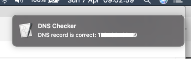

# ISP Check

Compare the IP address reserved for the cable modem against the DNS entry registered for the same. If there is a mis-match alert the sysadmin to update the DNS record.



## Public repo on gitHub

<https://github.com/stevegroom/ispcheck>

```text
https://github.com/stevegroom/ispcheck.git
git@github.com:stevegroom/ispcheck.git
```

## DNS Check

<https://dns.google.com/resolve?name=groom.ch&type=A>

returns

```json
{
"Status": 0,
"TC": false,
"RD": true,
"RA": true,
"AD": false,
"CD": false,
"Question":[ {"name": "groom.ch.","type": 1}],
"Answer":[ {"name": "groom.ch.","type": 1,"TTL": 299,"data": "178.198.102.49"}],
"Comment": "Response from 216.40.47.26."}
````

Filter the results with the ```jq``` command:

```bash
curl -s https://dns.google.com/resolve?name=groom.ch | tee | jq -r .Answer[0].data
178.198.102.49
```

## Internet address check

<https://api.ipify.org?format=json>

returns

```json
{"ip":"178.198.102.49"}
````

```bash
curl -s https://api.ipify.org?format=json | tee | jq -r .ip
178.198.102.49
```

### Compare the two

```bash
if [ `curl -s https://api.ipify.org?format=json | tee | jq -r .ip` ==  `curl -s https://dns.google.com/resolve?name=groom.ch | tee | jq -r .Answer[0].data` ] ;then echo "OK" ; fi
```

## The macos script

isMyDnsOk.sh

```bash
#!/bin/bash

# Mac OS version
# Checks the dns entry for the cable modem against the current IP address
# and sends an pop-up notification.
# Steve Groom
# 06.04.2019

dnsRec=`curl -s https://dns.google.com/resolve?name=groom.ch | tee | jq -r .Answer[0].data`
ipAddr=`curl -s https://api.ipify.org?format=json | tee | jq -r .ip`

if
[ $ipAddr == $dnsRec ]
then
  message="DNS record is correct: $dnsRec"
else
  message="DNS record needs updating to: $ipAddr"
fi

osascript -e "display notification \"$message\" with title \"DNS Checker\" "
```

### Scheduling

Add this line:

```bash
0 20 * * * /Users/steve/development/docker/ispcheck/isMyDnsOk.sh
```

to your crontab:

```bash
$ crontab -e
crontab: no crontab for steve - using an empty one
crontab: installing new crontab
```

## Next steps

Create version that can be called from Jenkins (or Jenkins in a docker container).

__Steve Groom__  
__2019-04-06__